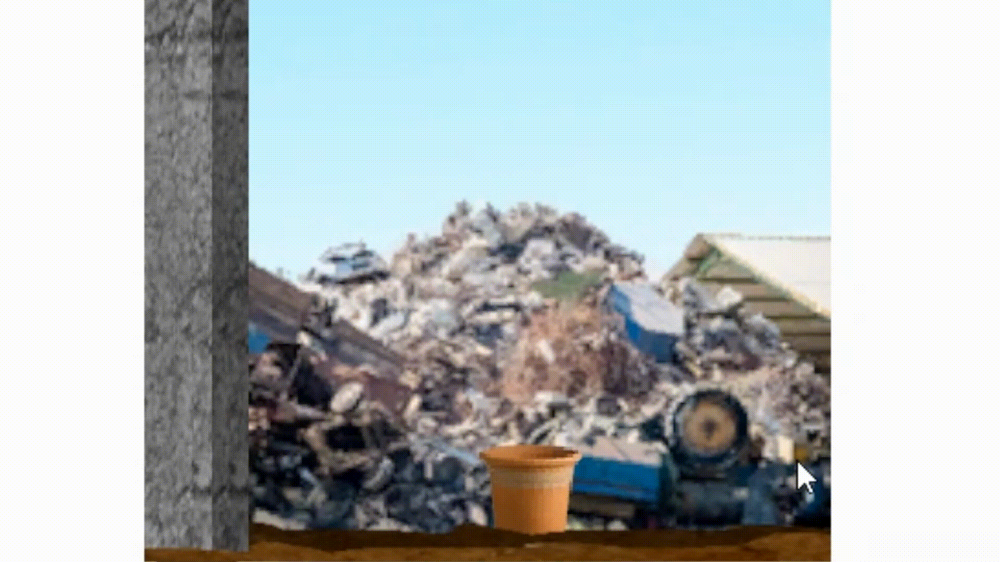

# Break Stuff

### Play here:
https://rileybax.github.io/Break-Stuff/

## How to Play

Click and hold on an object to drag it

Release to throw the object

Click an item to purchase it

## Deployment

This game is deployed using GitHub Pages and runs entirely in the browser.

### Built With

Unity

WebGL build for browser gameplay

GitHub Pages for hosting
